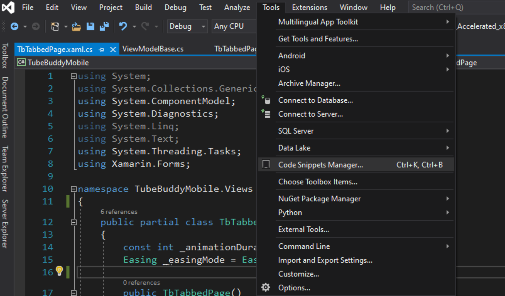
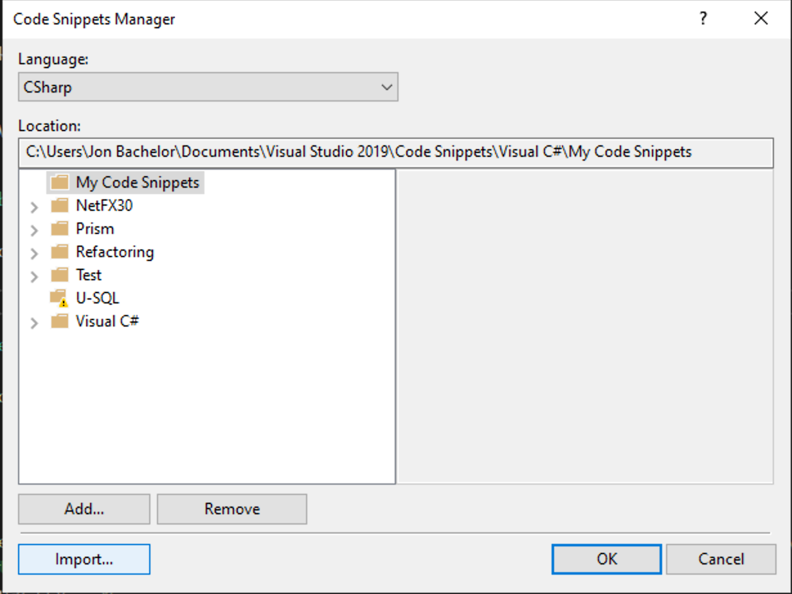
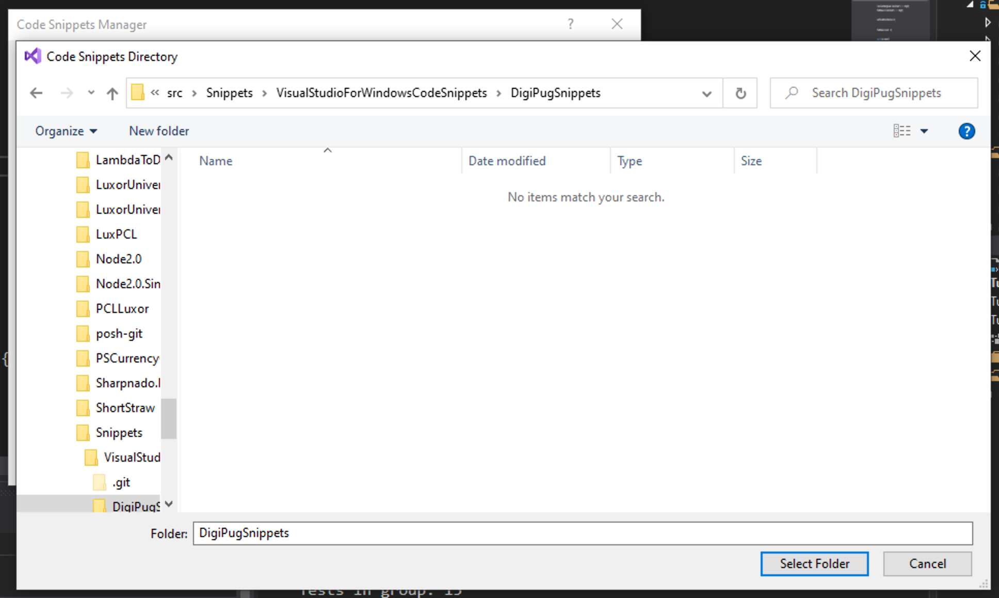
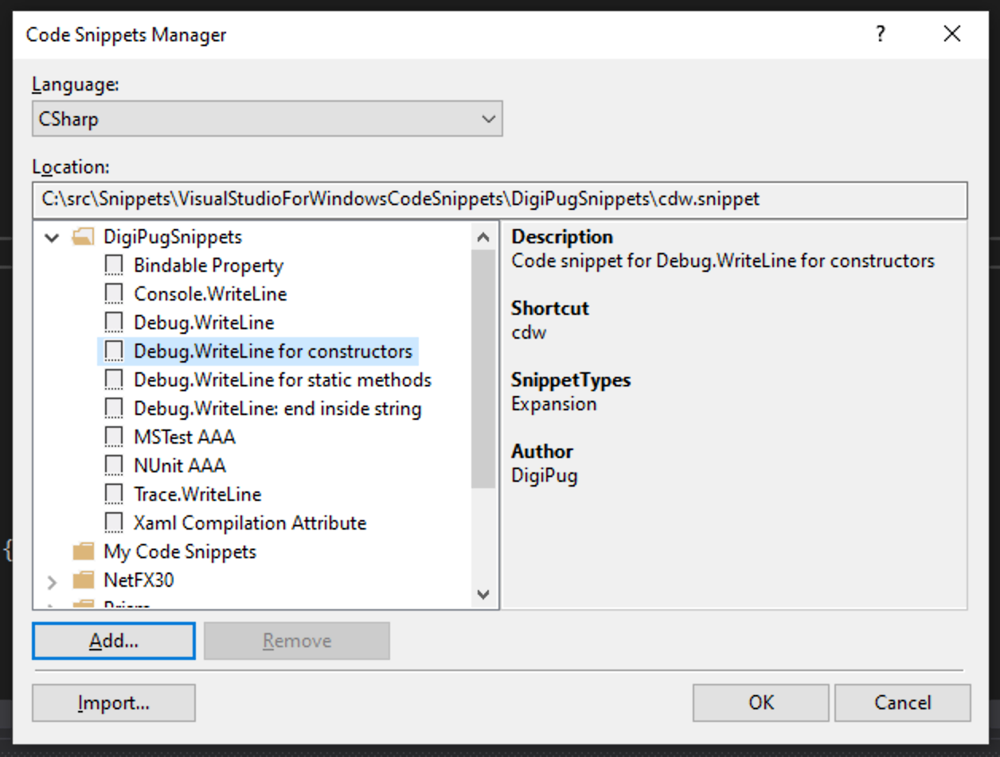

# Visual Studio For Windows Code Snippets #

This is simply personal collection of custom snippets I have created to make my life a little bit easier when working in Visual Studio 2019 for Windows. I'm primarily using [VS4Mac](https://visualstudio.microsoft.com/vs/mac/) these days, so this collection is a bit smaller than [that one](https://github.com/jbachelor/VisualStudioForMacSnippets).

### Adding Snippets to Visual Studio For Windows
Microsoft has some nice documentation on creating and adding snippets. Look for the heading, ["To Add a Code Snippet to Visual Studio"](https://docs.microsoft.com/en-us/visualstudio/ide/walkthrough-creating-a-code-snippet?view=vs-2019).

For convenience, here is a list of recommended steps:
1) Open the snippets manager
    * 

2) Click "Add"
    * 

3) Select the **DigiPugSnippets** folder from this cloned repository, then click "Select Folder"
    * 

4) You should now see the **DigiPugSnippets** library included in your list of available snippets
    * 

### Maybe Someday...
To make it easier for others to consume these snippets, it would be awesome if I were to distribute them using some [technique like this](https://docs.microsoft.com/en-us/visualstudio/ide/how-to-distribute-code-snippets?view=vs-2019). 

For now, I'm afraid you'll have to add them manually.